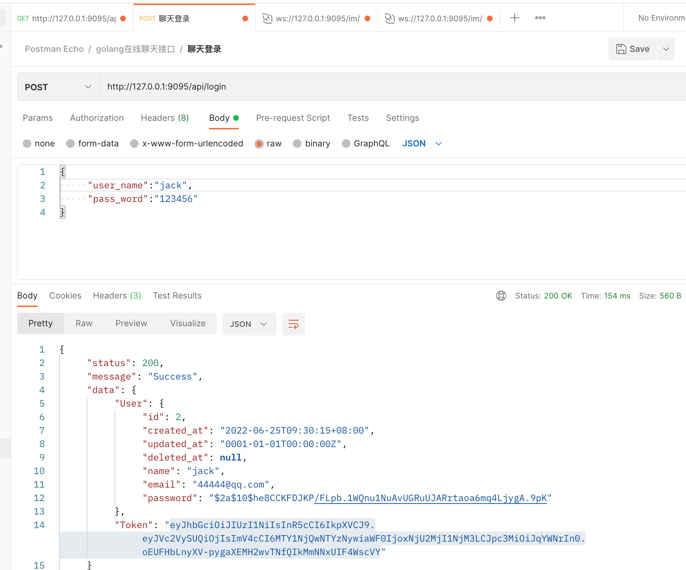
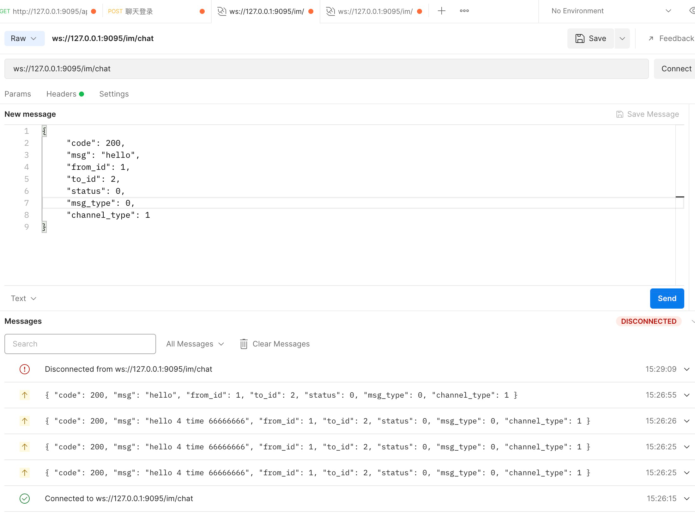

## GO-CHAT


> 这是一个由golang编写的在线聊天 (项目开发中，可以用postman测试websockert 私聊 以及 离线消息同步 )

#### 支持以下功能

   - [x] 支持账号密码
   - [x] 单聊消息、离线消息同步
   
   
> 一些库的使用。
 * gin
 * 集成mysql、redis、协程池
 * jwt签名认证
 * viper配置文件解析
 * rabbitmq存储离线消息
 

#### 安装使用

#### 安装redis
```shell
docker pull redis

docker run -p 6379:6379 --name redis
-v /data/redis/redis.conf:/etc/redis/redis.conf
-v /data/redis/data:/data
-d redis redis-server /etc/redis/redis.conf --appendonly yes
```

#### 安装mysql
```shell
docker pull mysql
docker run --name mysqlserver -v $PWD/conf:/etc/mysql/conf.d -v $PWD/logs:/logs -v $PWD/data:/var/lib/mysql -e MYSQL_ROOT_PASSWORD=123456 -d -i -p 3306:3306 mysql:latest
```
#### 安装rabbitmq
```shell
docker pull rabbitmq
docker run -d --hostname my-rabbit --name rabbit -p 15672:15672 -p 5672:5672 rabbitmq

```
#### 安装项目
```shell
git close https://github.com/JasonVanCode/go-chat.git
cd go-chat
```

#### 配置.env 调整.env文件配置
```shell
cp .env.example .env
```
#### 启动
```shell
go run main.go
```

## postman测试流程

#### 聊天消息定义
```
{
	"code": 200, //状态
	"msg": "hello", // 消息
	"from_id": 1, //发送者
	"to_id": 2, //接收者
	"status": 0, 
	"msg_type": 0,
	"channel_type": 1 // 1私聊 2 群聊
}

```
#### 登录获取token




#### 连接websocket




